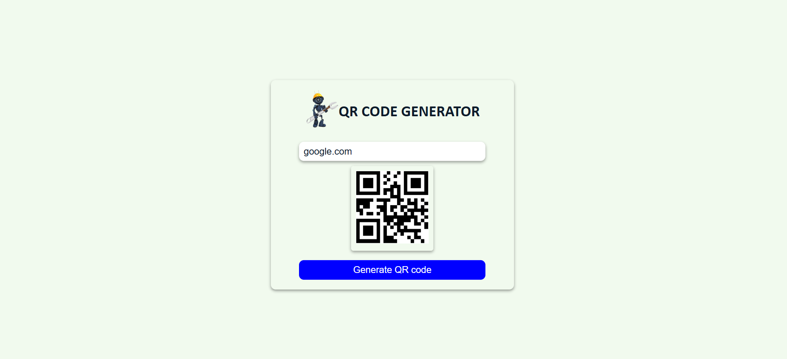

# QR CODE GENERATOR 🤖

I developed a QR Code Generator using HTML, CSS, and JavaScript. This simple application allows users to generate QR codes based on their input. It integrates the free GoQR.me API, which provides seamless QR code generation services.

## Preview 📸
Open the project click [here](https://naveenkumar-developer.github.io/QRcodeGenerator/) 

## Features 🚀

- **Dynamic QR Code Generation**: Enter any text or URL to instantly generate a QR code.
- **GoQR.me API Integration**: Leverages the free GoQR.me API for reliable and fast QR code creation.
- **Real-Time Updates**: QR codes are generated dynamically as the user inputs data.
- **Responsive Design**: The application is fully responsive, ensuring a seamless experience on all devices.

## How It Works 🛠️

1. Enter the desired text, URL, or information into the input field.
2. Click the "Generate QR code" button to create a QR code.
3. The generated QR code will appear instantly below the input field.

## Technologies Used 📝

- **HTML**: For the structure of the application.
- **CSS**: For styling and responsiveness.
- **JavaScript**: For dynamic QR code generation and interaction.
- **GoQR.me API**: Free API used to fetch QR code images.
